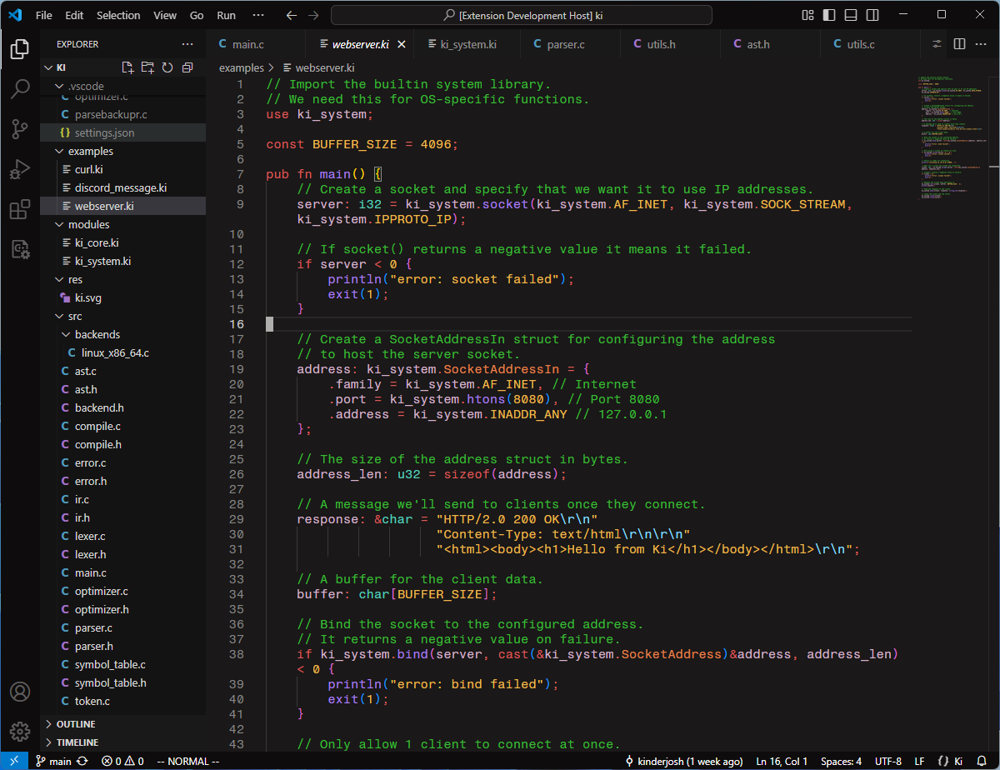

# Kai Color Theme for VSCode

Kai is a dark color theme inspired by Github Dark and Gruvbox. It's designed for usage with the [Ki programming language](https://github.com/kinderjosh/ki) and the [Ki language support](https://github.com/kinderjosh/ki-language-support) extension.

